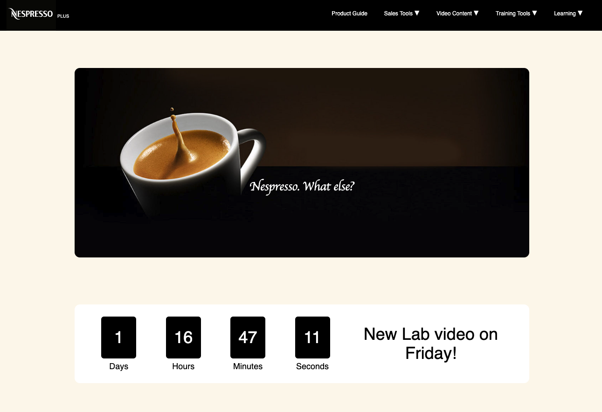
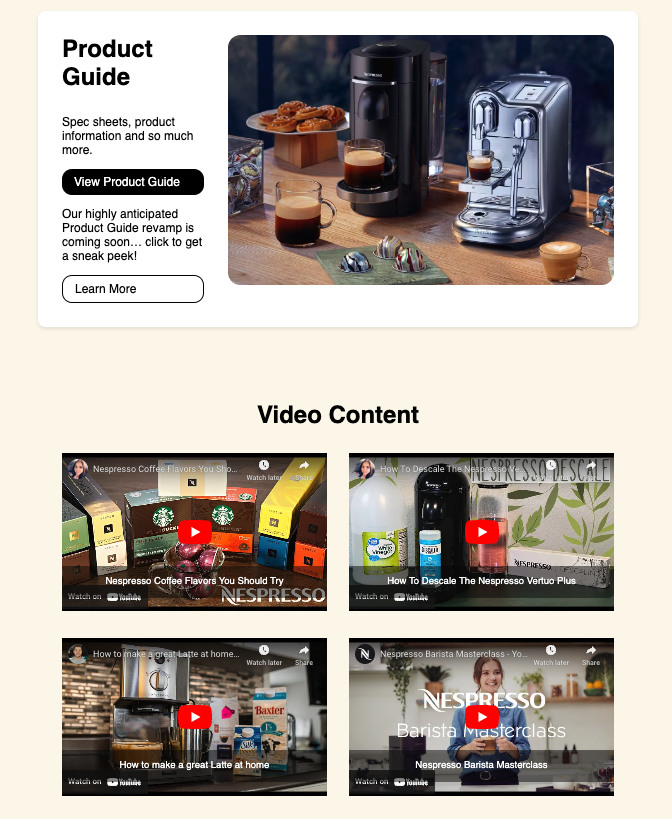
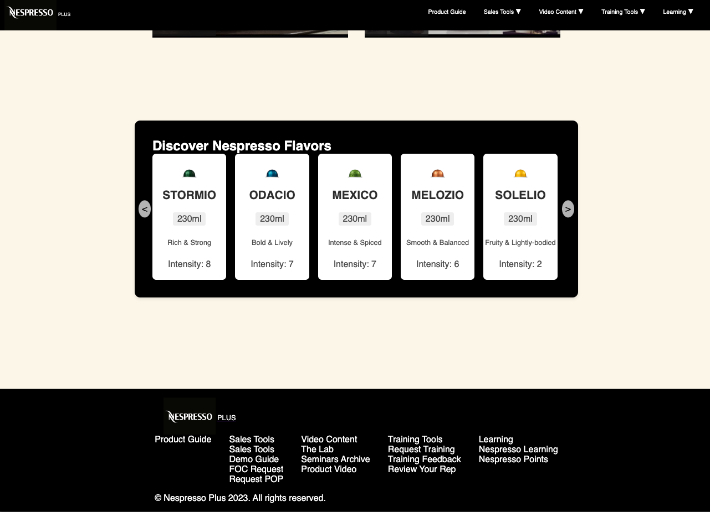

# ☕ Nespresso Plus Mock ☕

Nespresso Plus Mock is a web application designed to mimic a learning and development page for Nespresso. It showcases a meticulously designed site that features elements such as a new lab countdown, embedded YouTube videos related to the product, and a distinct flavor discovery section. The primary goal is to deliver a user-friendly platform that provides insights into Nespresso's products and flavors.

This project was a testament to the capabilities of foundational web technologies. Only JavaScript and CSS were employed to craft this application, emphasizing the power and flexibility these tools offer even without heavier frameworks.

It's worth noting that the primary focus of this application is on design, user experience, and seamless content integration. The beauty of the site lies in its simplicity and how it effectively conveys the essence of Nespresso's learning and development initiatives.

## Live Website 🌐

### [Nespresso Plus Mock](https://nespresso-plus-mock.vercel.app/)

## Developer 🤝

### 🧑‍💻 [David Benner](https://github.com/davebenner14)

## Technologies Used 💻

- [Javascript](https://devdocs.io/javascript/)

## Screenshots 📸

